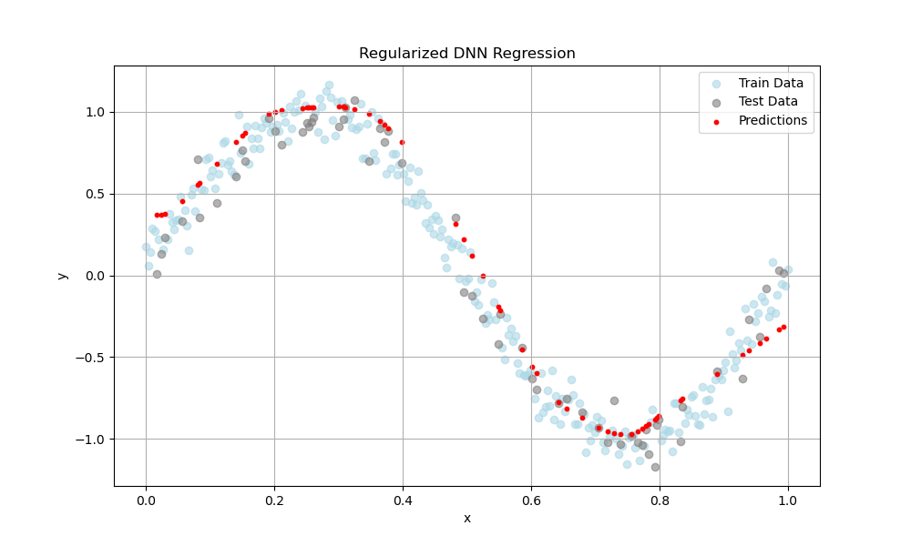

# Question 3 – Regularization in Deep Neural Networks

## Objective

Fit a deep neural network to a noisy 1D regression dataset based on the function:

$
y = \sin(2\pi x) + \epsilon
$

where $\epsilon$ is Gaussian noise.

## Instructions

- You must implement a deep neural network using either **Keras (TensorFlow)** or **PyTorch**.
- The model must have **at least 6 hidden layers** and, therefore, be prone to **overfitting**.
- You are required to apply **at least one regularization technique**.
- Your goal is to **reduce overfitting and achieve a smooth fit** to the function.
- Complete your code in the `build_and_train_model` function in `student_template.py`.

## Output

Your function must return the predictions for the test input set. You can visualize performance with the provided `test.py`.

Example:

---
